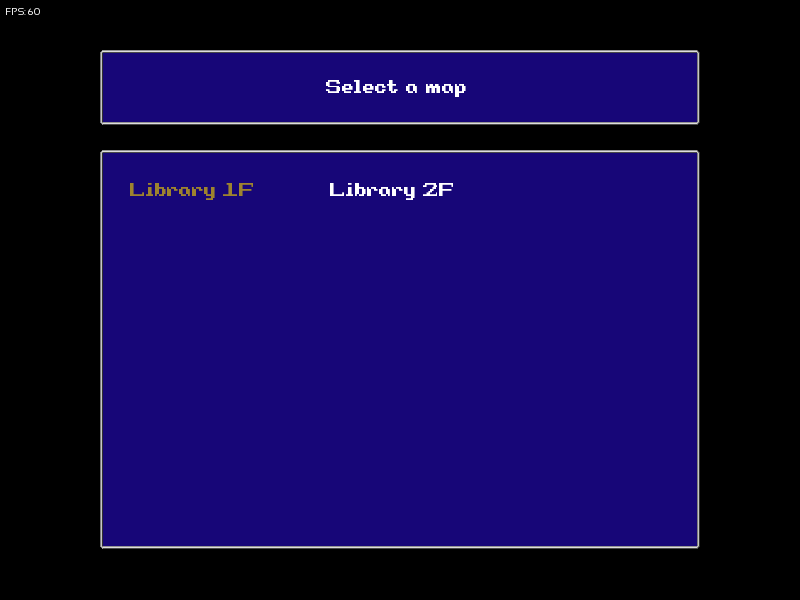
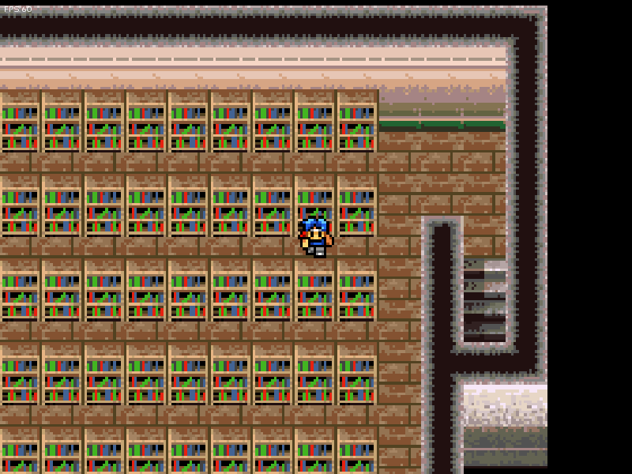
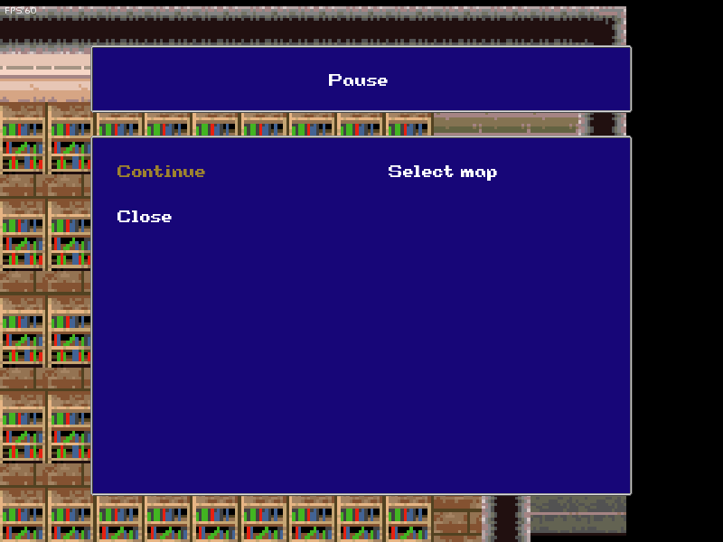

# SaGa I | Makai Toushi | Final Fantasy Legend I

A modern port of the SaGa game released by SquareSoft for the GameBoy and Wonderswan color consoles.

## Index

- [About the game](#about-the-game)
- [Scope of the project](#scope-of-the-project)
- [Project requirements](#project-requirements)
- [Build](#build)
- [How to play](#how-to-play)
- [Screenshots](#screenshoots)

## About the game

The first entry in the SaGa series, released in 1989 on the Game Boy. While it shows very few features of what makes SaGa so famous, it plays slightly more like its sibling series, Final Fantasy. This game also has a remake on the WonderSwan Color which itself was ported later for smartphones. The story primarily revolves around a single character, and up to three allies who traverse a magic tower to explore multiple worlds, help solve their problems, and take on Ashura's minions as they climb higher up the gigantic tower, hoping to reach the top to defeat Ashura once and for all, and possibly live an easy life in Paradise.

The resources of WonderSwan have been used (sprites and music). To create the tilesets, [GIMP](https://www.gimp.org/) has been used and the maps have been created with [Tiled](https://www.mapeditor.org/) (you can find the files in **/extra/tiled** directory).

## Scope of the project

The idea is to only make the 1st world, because this is a lot of work, also I don't have faith that I will do everything, so it's more about how much stuff will be done before I get tired of this project.

You can track my activity by checking the Issues tab.

## Project requirements

- SFML version 2.6 installed via CMake (it will be downloaded with `cmake ..`, then compiled and linked as a library with `cmake --build .`)
- A C++20 compiler
- CMake 3.28

**Note:** It has only been tested and developed under Linux.

## Build

The steps for building the game are:

1. Create the build folder and cd build in the root directory of the project
2. Inside the build folder create the build files cmake ..
3. Build the project cmake --build . (it generates a src inside build folder)
4. Copy the media folder from root directory to the generated media folder inside build cp ../media/ ./src/media/
5. Execute the project with `./SaGa_exe`

## How to Play

Controls:

- Arrows: moves the character.
- Escape: Enter pause and display the pause menu.

## Screenshoots

